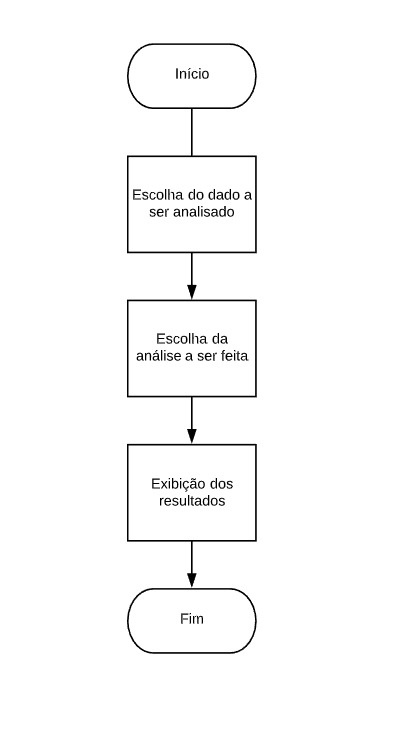
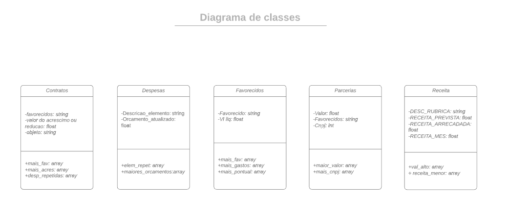
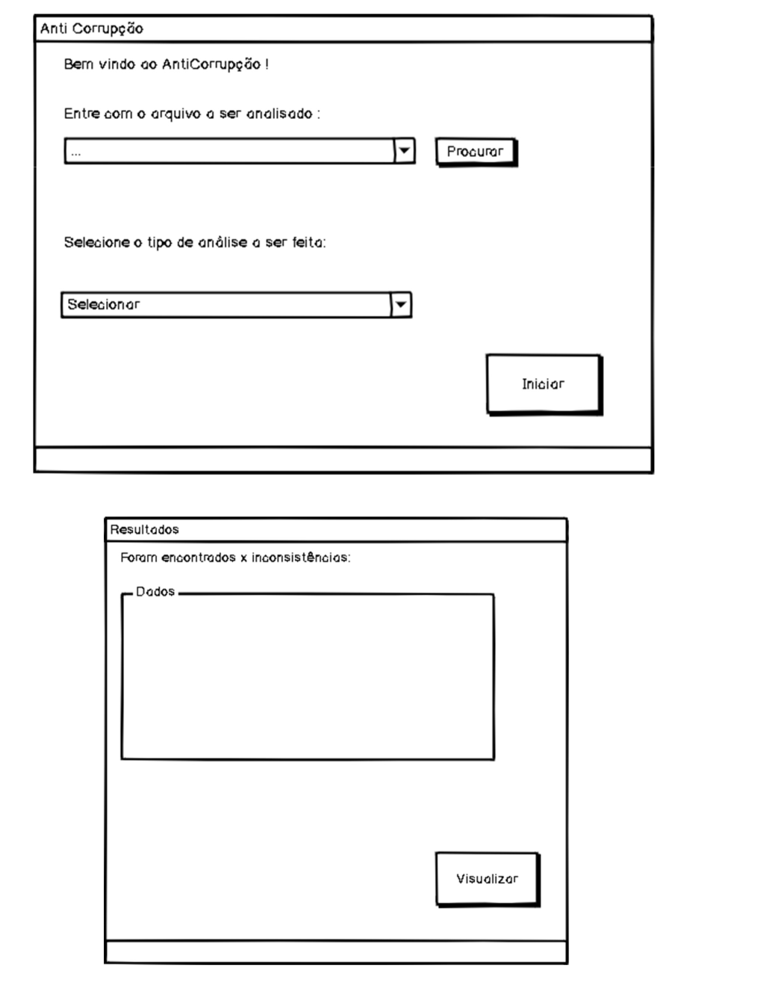

# victoria_anticorrupcao

O projeto tem o objetivo de criar um programa em python que interprete dados de despesa, receita, favorecidos por gastos, parcerias e contratos do Rio de Janeiro em 2019 para identificar possíveis atividades ilícitas. Os dados utilizados foram recolhidos do github do Hackfest e podem ser consultados no link a seguir:

https://github.com/mp-rj/dados-hackfestcc

A motivação era aprender do zero sobre data science, algo que acredito que vai me ajudar na vida profissional, em um projeto envolvente e que tem disponível muitas fontes para consulta.

# Escolha da biblioteca gráfica

Por se tratar de um projeto de ciência de dados a escolha da biblioteca gráfica apresentou algumas dificuldades, principalmente pelo desenvolvimento do código estar sendo feito em Google Colab, o que não era o planejado inicialmente. Como a biblioteca utilizada para análise de dados é a Pandas, escolheu-se a biblioteca Bamboo para gerar a GUI. Não foram encontrados tutoriais na internet, apenas vídeos exibindo como ela pode ser utilizada. Os links dos vídeos seguem abaixo:

https://www.youtube.com/watch?v=y5F4Brf7FBs

https://www.youtube.com/watch?v=I0a58h1OCcg

# Fluxograma e Diagrama de classes e relacionamentos

Os dados escolhidos para serem analisados foram:

1. Contratos
Com esses dados há a possibilidade verificas as pessoas/empresas mais favorecidas com contratos, ver os contratos que sofreram mais acréscimos durante o tempo de execução e as contratos com o mesmo tipo de depesa repetidamente.

2. Despesas
Com esses dados é possível observar gastos repetitivos e os orçamentos de projetos mais distantes da média.

3. Favorecidos
Há a possibilidade de verificar pessoas que aparecem mais vezes entre os gastos, além dos favorecidos com maior volume de gastos e despesas pontuais muito acima da média.

4. Parcerias
Possibilidade de verificar quais parceiros recebem mais dinheiro, CNPJs que mais aparecem entre os parceiros, podendo verificar no futuro se eles CNPJs são de fato verdadeiros.

5. Receita
Pode-se verificar quais receitas arrecadas estão mais baixas que o esperado, além da existência de algum mês em especial que os valores arrecadados foram bem menores que a média.

O fluxograma pode ser visto a seguir:

O diagrama de classes foi feito com cada classe sendo uma planilha de dados, cada atributo sendo uma coluna que será útil e nos métodos as matrizes de análise que se pretende gerar.

# Esboço GUI projeto

A imagem a seguir é um esboço da interface que se deseja criar, sendo os arquivos a serem analisados as 5 planilhas de dados (contratos, despesas, favorecidos, parcerias e receita). O tipo de análise varia dependendo da planilha escolhida.

# Esboço do projeto

Inicialmente surgiram várias dificuldades no projeto, foram utilizados duas diferentes IDLE, mas não estava dando certo baixar todas as bibliotecas necessárias. Quando foi possível exibir os dados, não estavam de forma clara e manipulá-los estava muito difícil. Então, foi preferível analisar os dados inicialmente em Excel, ambiente mais confortável para mim que estou começando com data science, excluir colunas que a princípio não seriam úteis e renomear colunas que estavam com caracteres como acentos e ç. 
Para poder visualizar melhor os dados e resolver os problemas de baixar todas as bibliotecas no Windows, decidiu-se utilizar o Google Colab, um ambiente de notebooks Jupyter que não requer configuração e é executado na nuvem, além de escrever e executar códigos em Python, que é o desejado.

A seguir o link do colab:

https://colab.research.google.com/drive/1gEiwc84tXKUU7am_pPl21QFQIOH7r6cP

edit: Por algum motivo que ainda estou tentando descobrir, meu trabalho não foi salvo nesse link, então enquanto não descubro como recuperar, vou tentar refazer no link abaixo:

https://colab.research.google.com/drive/1hzEBTRAUW5kVoOyPvXTRkdbG-bvefwPu

